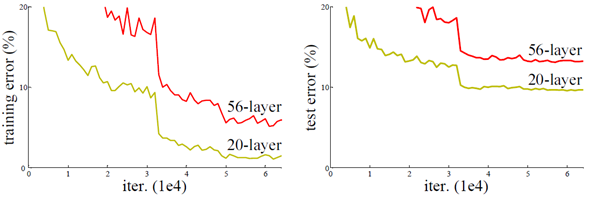
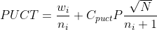

# Methods

## 零、前言

這一章節主要描述 dlgo 裡使用的技術和實做方法，輔助讀者理解程式碼的內容。

## 一、棋盤資料結構

如果同學們以前有自己嘗試實做圍棋棋盤，應該可以發現圍棋棋盤和圖論有莫大的關係，首先棋盤大部份點和點之間是等價的，二來棋盤是一個平面圖，這些圖論性質暗示者在棋盤上找某些特定元素可能會非常困難，像是找出棋盤上活棋棋串，有些甚至無法保證可以找出來，像是雙活。慶幸的是，基本常用的資料結構是有定論的，接下來我們要討論如何快速計算棋盤上每一塊棋串的狀態

### MailBox

我們知道如果程式中分支條件越多，性能就會越低，假設我要找棋盤上某一點四周的氣，那就必須用四個分支條確保不會搜尋到到棋盤外，而且搜尋四周邊是使用次數非常多的功能，這將會有巨大的性能消耗，為了解決這個問題，我們要使用一個棋盤遊戲中常用的資料結構，MailBox 。假設我有一個大小為五棋盤如下

       a b c d e
    1  . . . . .
    2  . . . . .
    3  . . . . .
    4  . . . . .
    5  . . . . .


改進前的資料結構虛擬碼如下（注意這邊是使用一維陣列）

    BLACK = 0
    WHITE = 1
    EMPTY = 2
    INVLD = 3 # out of board value

    find_adjacent(index):
        type_count[4] = {0,0,0,0}

        for adjacent in index
            if adjacent is out of board
                type_count[INVLD] += 1
            else
                type = board[adjacent]
                type_count[type] += 1


MailBox 的核心概念就是在棋盤外圍加一圈無效區域（標示為 ```-``` 的位置），這樣就不用特別判斷是否超出邊界

        a b c d e
      - - - - - - -
    1 - . . . . . -
    2 - . . . . . -
    3 - . . . . . -
    4 - . . . . . -
    5 - . . . . . -
      - - - - - - -

改進後的資料結構虛擬碼如下，可以看見不僅性能提，整個程式碼也簡潔不少

    BLACK = 0
    WHITE = 1
    EMPTY = 2
    INVLD = 3 # out of board value

    find_adjacent(vertex):
        type_count[4] = {0,0,0,0}

        for adjacent in vertex
            type_count[type] += 1


在本程式的實做當中，如果是使用改進前版本的座標表示法，則稱為 index ，一般用於輸出盤面資料給外部使用。如果是使用改進後版本的座標表示法，則稱為 vertex，，一般用於內部棋盤搜尋。

### 棋串（string）

棋串可以看成是整個棋盤中的子圖（sub-graph），而且它是一個節點循環的圖，我們來看看下列結構，board position 是當前盤面，可以看到有兩個黑棋棋串，vertex position 是當前 vertex 的座標數值（一維陣列），string identity 是棋串的 identity，這邊注意的是 identity 指到的位置是整個棋串的 root vertex 位置，像是 identity 為 16 的棋串，其 16 的 vertex 座標必在此棋串內，此位置也為此棋串的根節點，至於為甚麼要這樣做，稍後再來討論，最後 next position 指向下一個節點位置，而且它們是循環的，像是 identity 為 16 的棋串，他的 next position 串接起來為 (17->18->16) -> (17->18->16) -> ... 無限循環

    board position
       a b c d e
    1| . . . . .
    2| . x x x .
    3| . . . . .
    4| . x x . .
    5| . . . . .
        
    vertex position
       a  b  c  d  e
    1| 8  9  10 11 12
    2| 15 16 17 18 19
    3| 22 23 24 25 26
    4| 29 30 31 32 33
    5| 36 37 38 39 40

    string identity
       a  b  c  d  e
    1| .  .  .  .  .
    2| .  16 16 16 .
    3| .  .  .  .  .
    4| .  30 30 .  .
    5| .  .  .  .  .

    next position
       a  b  c  d  e
    1| .  .  .  .  .
    2| .  17 18 16 .
    3| .  .  .  .  .
    4| .  31 30 .  .
    5| .  .  .  .  .


假設今天我們要找一個棋串的氣，只要從一個節點開始走下去，依序計算直到走到原位置，虛擬碼如下

    conut_liberty(vertex):
        start_pos = identity[vertex] # get the start vertex postion

        next_pos = start_pos
        liberty_set = set()
        {
            for adjacent in next_pos
                if board[adjacent] == EMPTY
                    liberty_set.add(adjacent) # add the adjacent vertex to set

            next_pos = next[next_pos] # go to next vertex postion
        } while(next_pos != start_pos)

        liberties = length(liberty_set)


### 儲存棋串（string）資訊

剛剛講了 identity 指向棋串的 root vertex，這 root vertex 可以儲存棋串的狀態資訊，當需要用到這些資訊時，不必每次都重算，像是棋串棋子數目，或是棋串氣數等等。本程式實做的資料結構如下


    string identity
       a  b  c  d  e
    1| .  .  .  .  .
    2| .  16 16 16 .
    3| .  .  .  .  .
    4| .  30 30 .  .
    5| .  .  .  .  .


    string stones
       a  b  c  d  e
    1| .  .  .  .  .
    2| .  3  .  .  .
    3| .  .  .  .  .
    4| .  2  .  .  .
    5| .  .  .  .  .

    string liberty set
       a  b  c  d  e
    1| .  .  .  .  .
    2| .  A  .  .  .
    3| .  .  .  .  .      # A = liberty set of string 16
    4| .  B  .  .  .      # B = liberty set of string 30
    5| .  .  .  .  .


### 合併棋串（string）

兩個棋串合併時，只要簡單的交換雙方接觸點的 next position，並把 string identity 、string stones 和 string liberty set 更新即可，如下所示。如果是多個棋串合併，只要簡單的把兩兩棋串一個個合併就好。

    board position
       a  b  c  d  e
    1| .  .  .  .  .
    2| .  x  x  x  .
    3| . [x] .  .  .
    4| .  x  .  .  .
    5| .  .  .  .  .

    Merge two strings...

    string identity
       a  b  c  d  e             a  b  c  d  e
    1| .  .  .  .  .          1| .  .  .  .  .
    2| .  16 16 16 .          2| .  16 16 16 . 
    3| .  30 .  .  .    >>    3| .  16 .  .  .
    4| .  30 .  .  .          4| .  16 .  .  .
    5| .  .  .  .  .          5| .  .  .  .  .

    next position
       a  b  c  d  e             a  b  c  d  e
    1| .  .  .  .  .          1| .  .  .  .  .
    2| .  17 18 16 .          2| .  30 18 16 .
    3| .  30 .  .  .    >>    3| .  17 .  .  .
    4| .  23 .  .  .          4| .  23 .  .  .
    5| .  .  .  .  .          5| .  .  .  .  .

    string stones
       a  b  c  d  e             a  b  c  d  e
    1| .  .  .  .  .          1| .  .  .  .  .
    2| .  3  .  .  .          2| .  5  .  .  .
    3| .  .  .  .  .    >>    3| .  .  .  .  .
    4| .  2  .  .  .          4| .  .  .  .  .
    5| .  .  .  .  .          5| .  .  .  .  .


    string liberty set
       a  b  c  d  e             a  b  c  d  e
    1| .  .  .  .  .          1| .  .  .  .  .
    2| .  A  .  .  .          2| .  C  .  .  .
    3| .  .  .  .  .    >>    3| .  .  .  .  .    # set C = set A + set B
    4| .  B  .  .  .          4| .  .  .  .  .
    5| .  .  .  .  .          5| .  .  .  .  .


### 偵測合法手

依據不同的圍棋規則，合法手會有不同定義，為了方便討論問題，這裡依據本程式的實做給予合法手兩個基本條件

1. 此手棋下下去後，最終結果不為零氣，簡單來講就是不能自殺
2. 禁止同一盤棋出現相同盤面（super ko）

先討論第一點不能自殺，避免自殺有三種方式

1. 四周至少有一點為空點
2. 四周與自身相同的顏色的棋串，至少一塊棋超過一氣
3. 四周與自身相異的顏色的棋串，至少一塊棋為一氣（提吃）

    
       is_suicide(vertex):
           for adjacent in vertex
               if board[adjacent] == EMPTY
                   return false
       
               if board[adjacent] == MY_COLOR &&
                      string_liberties[adjacent] > 1:
                   return false
       
               if board[adjacent] == OPP_COLOR &&
                      string_liberties[adjacent] == 1:
                   return false
           return true

以上其中一個條件滿足，則必不是自殺手。接著討論禁止相同盤面，由於偵測相同盤面會比較消耗計算力，一般我們以偵測劫為主，也就是是否為熱子，如果出現吃掉熱子棋況，則為非法手。熱子的定義為

1. 吃到一顆對方的棋子
2. 下的棋子最終結果只有一氣
3. 下的棋子最終結果只有一顆子

       is_ko(vertex):
           if captured_count == 1 &&
                  string_stones[vertex] == 1 &&
                  string_liberties[vertex] == 1
               return true
           return false

此三項都滿足，則必為熱子。如果為相同盤面但不是劫的情況，就沒有特別的算法，只能實際將棋子擺到棋盤上後，再看是否當前盤面和歷史盤面有重複。在 dlgo 的實做裡，只有在樹搜索的根節點上移除相同盤面的子節點，這樣能保證 dlgo 在符合 Tromp-Taylor 規則下，還有一定的性能。Tromp-Taylor 規則請看第六節。

## 二、審局函數

最早期的圍棋程式是沒有審局函數的，這是由於圍棋局勢多變缺乏明顯特徵，致使一直以來製作良好的審局函數都是一個大難題，一般而言都是以預測下一手棋的位置為主，通過快速落子到終局，得到勝負結果，相同盤面重複多次這個步驟後後，即可評估當前局面的好壞，可想而之，這樣得出的勝率自然不準。但自從深度學習開始興起，審局函數的問題便迎刃而解。這裡主要是對審局函數的一些基本描述，並不會涉及大多深度學習的部份。

### 基本狀態

假設今天有一個狀態  （當前盤面），它擁有數個動作  （最大合法手），執行動作者為代理人  （程式本體），我們會希望從當前狀態得到兩類資訊，第一類是策略（policy）資訊，告訴代理人哪些動作值得被執行或是搜尋，在 AlphaGo 的實做中，此為最大合法手的分佈機率，第二類為價值（value）資訊，告訴代理人當前狀態的分數或是每個動作的分數在 AlphaGo 的實做中，此為當前盤面的分數（也能視為勝率），如下所示


### 訓練審局函數

根據前述的理論，我們收集當前狀態、下一步棋和本局的勝負當作訓練的資料，收集的結果為下

| 當前狀態       | 落子座標           | 勝負結果          |
| :------------: | :---------------: | :---------------: |
| S1（換黑棋落子）| ```e5```          | 黑棋獲勝          |
| S2（換白棋落子）| ```d3```          | 黑棋獲勝          |
| S3（換黑棋落子）| ```e5```          | 白棋獲勝          |
| S4（換白棋落子）| ```d3```          | 白棋獲勝          |

<br>

接下來將資料轉換成網路看得懂的資料，在本實做中，當前狀態為過去的八手棋（每手棋包含黑白兩個 planes ）和當前下棋的顏色做編碼（兩個 planes ），編碼成 18 個 planes（可到 board.py 裡的 get_features() 查看實做細節），落子座標轉成一維陣列，只有落子處為 1 ，未落子處為 0 ，勝負結果如果是當前玩家獲勝則是 1，如果落敗則為 -1。轉換的結果如下

| 當前狀態       | 落子座標           | 勝負結果          |
| :------------: | :---------------: | :---------------: |
| Inputs 1       | 40                | 1                 |
| Inputs 2       | 21                | -1                |
| Inputs 3       | 40                | -1                |
| Inputs 4       | 21                | 1                 |

<br>

網路希望的優化策略為下。現代神經網路的訓練方式一般採用[反向傳播](https://en.wikipedia.org/wiki/Backpropagation)，但你不需要實際了解演算法的詳細過程，只需要知道它是利用微分的方式，盡可能找到斜率比較低的點，此點也是網路參數中 Loss 最低的點，其原理類似於高中教的牛頓法。


其中 

 為資料的勝負結果

 為網路數出的 value

 為資料的落子座標陣列

 為網路數出的 policy

 為對網路參數的懲罰項

當然這不是唯一的編碼方式，像是 ELF Open Go 的勝負結果只看黑棋的一方，如下方

| 當前狀態       | 落子座標           | 勝負結果          |
| :------------: | :---------------: | :---------------: |
| Inputs 1       | 40                | 1                 |
| Inputs 2       | 21                | 1                 |
| Inputs 3       | 40                | -1                |
| Inputs 4       | 21                | -1                |

<br>

## 三、殘差神經網路（Residual Networks）

理論而言，越深的網路可以有更強的擬合能力和更好的準確性，但實際上，直接疊加網路並不能有更好的結果，反而可能有過擬合（overfitting）現象或是網路退化等問題，Resnet 作者認為這是由於深度過深，梯度無法順利傳遞下去導致的梯度消失/爆炸。下圖顯示 56 層的捲積層不論在訓練時或推論時，其準確度都比 34 層的表現更差。



為了解決此問題，作者提出 shortcut 結構，簡單粗暴的將最初的輸入加到最後的輸出中，此結構能夠讓梯度直接穿透多層網路，很好的避免了梯度消失/爆炸的問題，此種應用 shortcut 結構堆疊的網路稱為 Residual Networks（簡稱 Resnet）。Resnet 最大的好處和突破為，它可堆疊的層數幾乎沒有上限，基本上越深準度會越好，甚至在原論文中使用超過 1000 層的網路，也不會發生退化問題。通常我們稱一個 shortcut 結構為一個 block。


雖然在原本論文中，作者實做了多種不同變體的 block，但一般應用在棋盤遊戲的 Resnet 比較簡單，每層使用的 kernel size 固定為 3，每一個 block 使用兩個捲積層和兩個正規層，不使用 Max Pooling。

## 四、蒙地卡羅樹搜索（Monte Carlo Tree Search）

蒙地卡羅樹搜索是一種啟發式算法，最早由 Crazy Stone 的作者 Rémi Coulom 於 2006 年在他的論文 [Efficient Selectivity and Backup Operators in Monte-Carlo Tree Search](https://hal.inria.fr/inria-00116992/document) 中提出，他成功結合 [negamax](http://rportal.lib.ntnu.edu.tw/bitstream/20.500.12235/106643/4/n069347008204.pdf) 和蒙地卡羅方法，此方法最大的突破點在於，不同以往的圍棋程式，它僅須少量的圍棋知識就可以實做。時至今日，蒙地卡羅樹搜索經歷多次的公式修正和加入更多的啟發式搜索，如傳統的 UCT（Upper Confidence bounds applied to Trees）和 RAVE，和本次程式實做的 [PUCT](https://www.chessprogramming.org/Christopher_D._Rosin#PUCT) （'Predictor' + UCT ）。

### 蒙地卡羅方法（Monte Carlo Method）

蒙地卡羅方法的核心概念非常簡單，要知道某件事情發生的機率，我們只要模擬數次就可以得到近似發生的機率，但為何需要如此費力且不完全準確的方法呢？我以擲筊為例，大家應該都對筊杯不陌生，當生活遇到瓶頸時，或多或少都會有人擲筊請示神明，但不知道是否有人想過，擲出聖杯的機率到底是多少，依照古典算法，假設擲出正反兩面的機率是二分之一，那麼聖杯的機率是二分之一（笑杯也加入計算），但很顯然的，由於筊杯兩面不是對稱的，所以機率絕對不是二分之一。在一般情況下，擲出聖杯的機率是沒有辦法僅依靠計算得出的，此時蒙地卡羅方法就展現他的威力的，我只需要重複投擲一萬次，再計算共幾次聖杯即可。同樣的在圍棋上，由於圍棋的複雜性，早期圍棋是很難得出較為準確的勝率，但通過蒙地卡羅方法，讓同一個盤隨機模擬數次，即可算出一個相對來說較為可靠的勝率。

### 基本的 UCT（Upper Confidence bounds applied to Trees）

<div align=center>
    
</div>

傳統的 MCTS 的每輪迭代更新會經歷基本的四個步驟

1. 選擇：
由根節點開始，根據一定的選擇算法，找到一個葉節點（終端節點），傳統的 MCTS 會使用 UCT 公式作為選擇的依據，選擇 UCT 值最大的子節點往下搜尋，直到葉節點（終端節點，此節點尚無價值數值），它的公式如下


其中 

 表示節點累積己方的分數（或勝利次數）

 表示節點訪問次數

 表示探勘的參數

 表示父節點的訪問次數

2. 擴張：
將被選到的葉節點，生長新的子節點。新的子節點代表當前葉節點的合法走步

3. 模擬：
使用蒙地卡羅方法（Monte Carlo Method），計算第一步驟中被選到的葉節點的分數（或勝率）。通常只會模擬一次，回傳值不是輸就是贏

4. 迭代：
延著被選擇的路徑，依序迭代路徑，以當前節的顏色（對方或己方）更新分數（或勝率），迭代的節點訪問次數加一

如果仔細看的話，會發現我對於四個步驟的描述和圖片的執行過程稍有不一樣，但其實只是敘述方式不太一樣，計算結果會是一樣的。

### PUCT 的改進

<div align=center>
    
</div>

2017 年的 AlphaGo Zero 提出改進過的 MCTS 演算法，主要兩點不同，第一點是以 UCT 基礎上加入策略數值，第二就是移除隨機模擬的過程，所以只會重複三個步驟。

1. 選擇：
由根節點開始，根據 PUCT 選擇算法，選擇 PUCT 值最大的子節點往下搜尋，直到葉節點（終端節點，此節點尚無價值數值）



其中 

 表示節點累積的己方價值數值（即累積的勝率）

 表示節點訪問次數

 表示探勘的參數

 表示父節點的訪問次數

 表示節點的策略數值（即父節點走此節點的機率）

2. 擴張：
將被選到的葉節點，生長新的子節點。新的子節點代表當前葉節點的合法走步，並將神經網路策略數值加入新的子節點

3. 迭代：
延著被選擇的路徑上的每一個節點，依序迭代路徑，以當前節的顏色（對方或己方）更新神經網路價值數值（即勝率），迭代的節點訪問次數加一

AlphaGo Zero 版本的 MCTS 相當精簡，並且去除了模擬步驟，整體來講可以說是和跟蒙地卡羅方法毫無關係，理論上，此演算法不包含隨機性，由於本程式也是實做此版本的 MCTS 演算法，所以本程式在同個盤面上給相同的計算量時，每次的計算結果都會一致。

### 落子

最後 n 輪的 MCTS 結束後，找根節點上訪問次數最多的子節點當做最佳手輸出。

## 五、信賴上界（Upper Confidence bounds）

剛剛我們提到了 UCT 算法，但之前沒有提到它具體的原理，UCT 是一種將 UCB 應用在樹搜索上的計算方法，接下來我們會描述這個公式的運作原理


我們先思考一個實驗，假設有一吃角子老虎機，我拉了三次，出來的分數為 5 ,10, 7.5 分，此時我要怎估計它未來的收益呢？最簡單的方法是求算術平均數得到估計平均收益，但這樣有一個問題是我們不知道估計平均收益和真實平均收益大概差多少，間單來說就是我們我們不知道以 7.5 分當作平均收益，風險為多少，它的真實平均收益可能在 1 也可能在 100，UCB 公式的作用就是幫我們估計在某個信賴區間內真實平均收益可能存在的上限。如果你理解一些統計學的話，看到這裡你可能覺得很奇怪，因為 UCB 公式沒有計算變異數，它是怎得出信賴上界的？你想的沒錯，因為 UCB 公式只是經驗上湊出來的公式，它沒有真實的數學意義，你應該把它視為黑盒子，假定它得出來的值就是信賴上界，而實際上它的效果也很好。

我們再思考另一個問題，假設有多個吃角子老虎機，它們各有不同的收益，我要怎麼在有限次數內獲得最高收益？數學家給出的方法為計算每台機器的信賴上界，也就是 UCB 數值，每次拉霸之前都計算一次，找最大值的機器拉霸。同樣的情況我們放回蒙地卡羅樹搜索，多個節點就像多個吃角子老虎機，每次選擇前用 UCB 公式就可以找到當前最佳路徑。

有一點要注意的是 UCT 和其變體（如 PUCT），它們源自於 UCB1 演算法（一種 UCB 算法），UCB1 的唯一假定是收益必須在 0 到 1 之間，所以 dlgo 有重新壓縮神經網路出來的數值，將數值 -1 到 1 壓縮至 0 到 1 之間。

## 六、Tromp-Taylor 規則

一般的圍棋規則分為兩大種類，日本規則和中國規則，日本規則的核心思想為只計算圍起來的空目，而中國規則是子地皆目，但不論是哪種規則，在實際執行上都會有問題，尤其是出現循環劫和多個複雜劫爭時，這些規則顯然不適合電腦圍棋，然而今天介紹的 Tromp-Taylor 規則對於棋盤的所有狀態都有定義，還被譽為世界上最簡潔的圍棋規則，它是目前電腦圍棋主流使用的規則。

Tromp-Taylor 規則為中國規則的變體，計點方式也為子地皆目，主要特點為
1. 沒有定義死棋，凡事在棋盤上的棋子都視為某方的領地
2. 如果某區域被黑方包圍且沒有白棋，則視為黑棋的領地
3. 如果某區域同時接觸黑棋和白棋，則不視為某方領地
4. 禁止出現和過去相同的盤面（禁全同），這個特性定義了劫
5. 棋子可以自殺

由於沒有定義死棋和禁全同，一來循環劫不可能產生，二來出現複雜劫爭也都有實際定義，不會有實戰解決的問題。下圖為計地範例，標記的白棋在其它一般規則下可能會被視為死棋，但在 Tromp-Taylor 規則下視為活棋，視為白方的領地，而其周圍五點區域同時接觸黑棋和白棋，被視為單官，剩餘的領地都明確被某一方包圍，視為包圍方的領地。

<div>
    
</div>

dlgo 基本實作所有的 Tromp-Taylor 規則，不同之處是 dlgo 禁止自殺手。

## 七、其它

* 為什麼要對顏色編碼？

因為貼目在棋盤上是無法被感知的。


* 為什麼 dlgo 輸入是十八層 planes 而不是 AlphaGo Zero 的十七層？

dlgo 使用十八層輸入而非 AlphaGo Zero 的十七層，在原版的 AlphaGo Zero 中，顏色只編碼成一層而已，如果是黑色則編碼為 1 ，反之為 0 ，而 dlgo 改為兩層，如果是黑色則第一層編碼為 1，反之第二層編碼為 1，根據 Leela Zero 作者的解釋，AlphaGo Zero 的編碼方式會使得黑色和白色不平衡，導致黑棋更容易看到棋盤邊緣。


* 為什麼沒有實做 AlphaGo 的快速走子（Fast Policy）網路？

快速走子網路主要是輔助 AlphaGo 估計當前盤面價值，並且獲得領先目數，領地等額外資訊。但一來快速走子網路對於 Python 增益有限，二來現代現代的用於圍棋的神經網路非常大，準確度非常高，相比下快速走子對於盤面價值估計效果不好，因此沒必要再使用快速走子網路。


* 為什麼 AlphaGo 的價值網路和策略網路是分開的？

我猜這主要是歷史原因，AlphaGo 是先實做策略網路，後來才實做價值網路，最後才合併，AlphaGo 第一版論文出現是在合併前。事實上合併後的推論速度較快，網路的準確率較高，所以分開並沒有好處。


* 為什麼 AlphaGo Zero 在優勢時會持續退讓？

一般會認為這和蒙地卡羅樹搜索有關，雖然正確但並不完全是這樣，事實上和強化學習的系統也有關系，因為在自我對戰的過程中，並沒有強迫它下可以贏較多的位置，導致產生的自戰棋譜在優勢時品質降低。如果你用高強度的人類棋譜訓練 dlgo，你會發現蒙地卡羅樹搜索和神經網路的組合並不會有明顯的退讓行為。


* 是否建議實做強化學習？

自 2023 年後，純粹用 python 實做強化學習在圍棋上已經被證明是可行的，可參考 [TamaGo](https://github.com/kobanium/TamaGo)。

