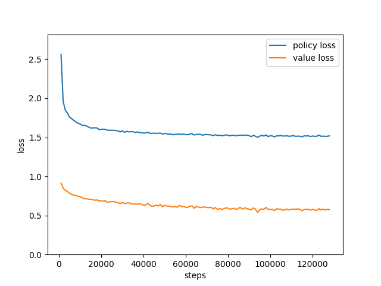

# Training

## 訓練的資訊

依照訓練範例輸入下列指令，終端機會出現一系列訊息，幫助掌握目前學習的進度和情況，第一部份是程式在載入解析 sgf 當案並產生訓練資料，並存入 ```data-cache``` 裡，當出現 ```parsed 100.00% games``` 時，代表棋譜已經全處理完成。第二部份就開始訓練網路，大部份資訊我想理解上不是問題，其中 ```rate``` 代表每秒訓練幾個 steps ，```estimate``` 代表完成訓練估計的剩餘秒數。

    $ python3 train.py --dir sgf-directory-name --steps 128000 --batch-size 512 --learning-rate 0.001 --weights-name weights
    imported 34572 SGF files
    parsed 1.00% games
    parsed 2.00% games
    parsed 2.99% games
    parsed 3.99% games
    parsed 4.99% games
    parsed 5.99% games
    parsed 6.99% games
    parsed 7.98% games
    parsed 8.98% games
    parsed 9.98% games
    parsed 10.98% games
    parsed 11.98% games
    parsed 12.97% games
    .
    .
    .
    parsed 92.81% games
    parsed 93.80% games
    parsed 94.80% games
    parsed 95.80% games
    parsed 96.80% games
    parsed 97.80% games
    parsed 98.79% games
    parsed 99.79% games
    parsed 100.00% games
    [2022-3-18 22:06:42] steps: 1000/128000, 0.78% -> policy loss: 2.5627, value loss: 0.9143 | rate: 58.62(steps/sec), estimate: 2166(sec)
    [2022-3-18 22:07:00] steps: 2000/128000, 1.56% -> policy loss: 1.9588, value loss: 0.8503 | rate: 55.47(steps/sec), estimate: 2271(sec)
    [2022-3-18 22:07:18] steps: 3000/128000, 2.34% -> policy loss: 1.8491, value loss: 0.8228 | rate: 57.48(steps/sec), estimate: 2174(sec)
    [2022-3-18 22:07:36] steps: 4000/128000, 3.12% -> policy loss: 1.8122, value loss: 0.8065 | rate: 55.31(steps/sec), estimate: 2242(sec)
    [2022-3-18 22:07:54] steps: 5000/128000, 3.91% -> policy loss: 1.7586, value loss: 0.7864 | rate: 56.84(steps/sec), estimate: 2164(sec)
    [2022-3-18 22:08:11] steps: 6000/128000, 4.69% -> policy loss: 1.7399, value loss: 0.7695 | rate: 58.57(steps/sec), estimate: 2083(sec)
    [2022-3-18 22:08:28] steps: 7000/128000, 5.47% -> policy loss: 1.7173, value loss: 0.7587 | rate: 57.62(steps/sec), estimate: 2100(sec)
    [2022-3-18 22:08:46] steps: 8000/128000, 6.25% -> policy loss: 1.6980, value loss: 0.7596 | rate: 55.39(steps/sec), estimate: 2166(sec)
    [2022-3-18 22:09:04] steps: 9000/128000, 7.03% -> policy loss: 1.6809, value loss: 0.7423 | rate: 57.01(steps/sec), estimate: 2087(sec)
    [2022-3-18 22:09:21] steps: 10000/128000, 7.81% -> policy loss: 1.6723, value loss: 0.7393 | rate: 55.87(steps/sec), estimate: 2112(sec)
    [2022-3-18 22:09:38] steps: 11000/128000, 8.59% -> policy loss: 1.6539, value loss: 0.7287 | rate: 59.65(steps/sec), estimate: 1961(sec)
    [2022-3-18 22:09:56] steps: 12000/128000, 9.38% -> policy loss: 1.6534, value loss: 0.7135 | rate: 56.55(steps/sec), estimate: 2051(sec)
    [2022-3-18 22:10:12] steps: 13000/128000, 10.16% -> policy loss: 1.6464, value loss: 0.7167 | rate: 60.91(steps/sec), estimate: 1888(sec)
    [2022-3-18 22:10:30] steps: 14000/128000, 10.94% -> policy loss: 1.6329, value loss: 0.7065 | rate: 57.94(steps/sec), estimate: 1967(sec)
    [2022-3-18 22:10:47] steps: 15000/128000, 11.72% -> policy loss: 1.6203, value loss: 0.7064 | rate: 57.48(steps/sec), estimate: 1965(sec)
    [2022-3-18 22:11:04] steps: 16000/128000, 12.50% -> policy loss: 1.6204, value loss: 0.7007 | rate: 57.85(steps/sec), estimate: 1936(sec)
    [2022-3-18 22:11:22] steps: 17000/128000, 13.28% -> policy loss: 1.6226, value loss: 0.6969 | rate: 56.33(steps/sec), estimate: 1970(sec)
    [2022-3-18 22:11:41] steps: 18000/128000, 14.06% -> policy loss: 1.6208, value loss: 0.7004 | rate: 53.50(steps/sec), estimate: 2056(sec)
    [2022-3-18 22:11:58] steps: 19000/128000, 14.84% -> policy loss: 1.5990, value loss: 0.6839 | rate: 57.20(steps/sec), estimate: 1905(sec)
    [2022-3-18 22:12:16] steps: 20000/128000, 15.62% -> policy loss: 1.6045, value loss: 0.6868 | rate: 54.86(steps/sec), estimate: 1968(sec)
    [2022-3-18 22:12:33] steps: 21000/128000, 16.41% -> policy loss: 1.6040, value loss: 0.6831 | rate: 59.90(steps/sec), estimate: 1786(sec)
    [2022-3-18 22:12:51] steps: 22000/128000, 17.19% -> policy loss: 1.6024, value loss: 0.6887 | rate: 57.02(steps/sec), estimate: 1859(sec)
    [2022-3-18 22:13:08] steps: 23000/128000, 17.97% -> policy loss: 1.5903, value loss: 0.6652 | rate: 58.84(steps/sec), estimate: 1784(sec)
    [2022-3-18 22:13:26] steps: 24000/128000, 18.75% -> policy loss: 1.5924, value loss: 0.6760 | rate: 54.78(steps/sec), estimate: 1898(sec)
    [2022-3-18 22:13:42] steps: 25000/128000, 19.53% -> policy loss: 1.5900, value loss: 0.6784 | rate: 60.90(steps/sec), estimate: 1691(sec)
    [2022-3-18 22:13:59] steps: 26000/128000, 20.31% -> policy loss: 1.5901, value loss: 0.6820 | rate: 59.29(steps/sec), estimate: 1720(sec)
    [2022-3-18 22:14:16] steps: 27000/128000, 21.09% -> policy loss: 1.5855, value loss: 0.6672 | rate: 58.16(steps/sec), estimate: 1736(sec)
    [2022-3-18 22:14:34] steps: 28000/128000, 21.88% -> policy loss: 1.5843, value loss: 0.6664 | rate: 56.64(steps/sec), estimate: 1765(sec)
    [2022-3-18 22:14:52] steps: 29000/128000, 22.66% -> policy loss: 1.5688, value loss: 0.6495 | rate: 54.80(steps/sec), estimate: 1806(sec)
    [2022-3-18 22:15:11] steps: 30000/128000, 23.44% -> policy loss: 1.5838, value loss: 0.6698 | rate: 53.59(steps/sec), estimate: 1828(sec)
    [2022-3-18 22:15:29] steps: 31000/128000, 24.22% -> policy loss: 1.5638, value loss: 0.6518 | rate: 56.76(steps/sec), estimate: 1708(sec)
    [2022-3-18 22:15:46] steps: 32000/128000, 25.00% -> policy loss: 1.5773, value loss: 0.6582 | rate: 56.63(steps/sec), estimate: 1695(sec)
    [2022-3-18 22:16:04] steps: 33000/128000, 25.78% -> policy loss: 1.5702, value loss: 0.6650 | rate: 57.30(steps/sec), estimate: 1658(sec)
    [2022-3-18 22:16:22] steps: 34000/128000, 26.56% -> policy loss: 1.5723, value loss: 0.6501 | rate: 53.49(steps/sec), estimate: 1757(sec)
    [2022-3-18 22:16:39] steps: 35000/128000, 27.34% -> policy loss: 1.5739, value loss: 0.6458 | rate: 58.74(steps/sec), estimate: 1583(sec)
    [2022-3-18 22:16:56] steps: 36000/128000, 28.12% -> policy loss: 1.5616, value loss: 0.6486 | rate: 61.29(steps/sec), estimate: 1501(sec)
    [2022-3-18 22:17:14] steps: 37000/128000, 28.91% -> policy loss: 1.5699, value loss: 0.6452 | rate: 54.92(steps/sec), estimate: 1657(sec)
    [2022-3-18 22:17:32] steps: 38000/128000, 29.69% -> policy loss: 1.5610, value loss: 0.6483 | rate: 55.38(steps/sec), estimate: 1625(sec)
    [2022-3-18 22:17:49] steps: 39000/128000, 30.47% -> policy loss: 1.5623, value loss: 0.6464 | rate: 58.77(steps/sec), estimate: 1514(sec)
    [2022-3-18 22:18:07] steps: 40000/128000, 31.25% -> policy loss: 1.5544, value loss: 0.6313 | rate: 55.43(steps/sec), estimate: 1587(sec)
    [2022-3-18 22:18:24] steps: 41000/128000, 32.03% -> policy loss: 1.5561, value loss: 0.6344 | rate: 60.28(steps/sec), estimate: 1443(sec)
    [2022-3-18 22:18:41] steps: 42000/128000, 32.81% -> policy loss: 1.5663, value loss: 0.6550 | rate: 58.49(steps/sec), estimate: 1470(sec)
    [2022-3-18 22:18:59] steps: 43000/128000, 33.59% -> policy loss: 1.5520, value loss: 0.6315 | rate: 54.88(steps/sec), estimate: 1548(sec)
    [2022-3-18 22:19:17] steps: 44000/128000, 34.38% -> policy loss: 1.5516, value loss: 0.6166 | rate: 54.13(steps/sec), estimate: 1551(sec)
    [2022-3-18 22:19:35] steps: 45000/128000, 35.16% -> policy loss: 1.5543, value loss: 0.6227 | rate: 57.33(steps/sec), estimate: 1447(sec)
    [2022-3-18 22:19:53] steps: 46000/128000, 35.94% -> policy loss: 1.5484, value loss: 0.6334 | rate: 56.61(steps/sec), estimate: 1448(sec)
    [2022-3-18 22:20:10] steps: 47000/128000, 36.72% -> policy loss: 1.5526, value loss: 0.6216 | rate: 58.87(steps/sec), estimate: 1375(sec)
    [2022-3-18 22:20:28] steps: 48000/128000, 37.50% -> policy loss: 1.5540, value loss: 0.6420 | rate: 53.49(steps/sec), estimate: 1495(sec)
    [2022-3-18 22:20:46] steps: 49000/128000, 38.28% -> policy loss: 1.5425, value loss: 0.6110 | rate: 55.50(steps/sec), estimate: 1423(sec)
    [2022-3-18 22:21:05] steps: 50000/128000, 39.06% -> policy loss: 1.5494, value loss: 0.6300 | rate: 52.44(steps/sec), estimate: 1487(sec)
    [2022-3-18 22:21:23] steps: 51000/128000, 39.84% -> policy loss: 1.5448, value loss: 0.6226 | rate: 56.87(steps/sec), estimate: 1354(sec)
    [2022-3-18 22:21:41] steps: 52000/128000, 40.62% -> policy loss: 1.5406, value loss: 0.6203 | rate: 54.77(steps/sec), estimate: 1387(sec)
    [2022-3-18 22:21:59] steps: 53000/128000, 41.41% -> policy loss: 1.5428, value loss: 0.6134 | rate: 56.75(steps/sec), estimate: 1321(sec)
    [2022-3-18 22:22:17] steps: 54000/128000, 42.19% -> policy loss: 1.5331, value loss: 0.6079 | rate: 54.10(steps/sec), estimate: 1367(sec)
    [2022-3-18 22:22:34] steps: 55000/128000, 42.97% -> policy loss: 1.5387, value loss: 0.6132 | rate: 58.18(steps/sec), estimate: 1254(sec)
    [2022-3-18 22:22:52] steps: 56000/128000, 43.75% -> policy loss: 1.5403, value loss: 0.6069 | rate: 56.04(steps/sec), estimate: 1284(sec)
    [2022-3-18 22:23:11] steps: 57000/128000, 44.53% -> policy loss: 1.5446, value loss: 0.6307 | rate: 54.43(steps/sec), estimate: 1304(sec)
    [2022-3-18 22:23:29] steps: 58000/128000, 45.31% -> policy loss: 1.5368, value loss: 0.6115 | rate: 54.64(steps/sec), estimate: 1281(sec)
    [2022-3-18 22:23:46] steps: 59000/128000, 46.09% -> policy loss: 1.5420, value loss: 0.6166 | rate: 59.38(steps/sec), estimate: 1162(sec)
    [2022-3-18 22:24:03] steps: 60000/128000, 46.88% -> policy loss: 1.5351, value loss: 0.6047 | rate: 56.63(steps/sec), estimate: 1200(sec)
    [2022-3-18 22:24:20] steps: 61000/128000, 47.66% -> policy loss: 1.5338, value loss: 0.6038 | rate: 60.84(steps/sec), estimate: 1101(sec)
    [2022-3-18 22:24:37] steps: 62000/128000, 48.44% -> policy loss: 1.5447, value loss: 0.6215 | rate: 57.14(steps/sec), estimate: 1155(sec)
    [2022-3-18 22:24:55] steps: 63000/128000, 49.22% -> policy loss: 1.5469, value loss: 0.6223 | rate: 56.20(steps/sec), estimate: 1156(sec)
    [2022-3-18 22:25:14] steps: 64000/128000, 50.00% -> policy loss: 1.5304, value loss: 0.5915 | rate: 53.05(steps/sec), estimate: 1206(sec)
    [2022-3-18 22:25:32] steps: 65000/128000, 50.78% -> policy loss: 1.5378, value loss: 0.6182 | rate: 54.35(steps/sec), estimate: 1159(sec)
    [2022-3-18 22:25:53] steps: 66000/128000, 51.56% -> policy loss: 1.5383, value loss: 0.6068 | rate: 49.76(steps/sec), estimate: 1246(sec)
    [2022-3-18 22:26:10] steps: 67000/128000, 52.34% -> policy loss: 1.5390, value loss: 0.6032 | rate: 57.46(steps/sec), estimate: 1061(sec)
    [2022-3-18 22:26:28] steps: 68000/128000, 53.12% -> policy loss: 1.5259, value loss: 0.6061 | rate: 55.30(steps/sec), estimate: 1084(sec)
    [2022-3-18 22:26:46] steps: 69000/128000, 53.91% -> policy loss: 1.5372, value loss: 0.6100 | rate: 56.86(steps/sec), estimate: 1037(sec)
    [2022-3-18 22:27:04] steps: 70000/128000, 54.69% -> policy loss: 1.5356, value loss: 0.6017 | rate: 55.32(steps/sec), estimate: 1048(sec)
    [2022-3-18 22:27:21] steps: 71000/128000, 55.47% -> policy loss: 1.5336, value loss: 0.6019 | rate: 59.49(steps/sec), estimate: 958(sec)
    [2022-3-18 22:27:37] steps: 72000/128000, 56.25% -> policy loss: 1.5306, value loss: 0.6040 | rate: 59.23(steps/sec), estimate: 945(sec)
    [2022-3-18 22:27:55] steps: 73000/128000, 57.03% -> policy loss: 1.5225, value loss: 0.5848 | rate: 58.19(steps/sec), estimate: 945(sec)
    [2022-3-18 22:28:11] steps: 74000/128000, 57.81% -> policy loss: 1.5334, value loss: 0.6007 | rate: 60.64(steps/sec), estimate: 890(sec)
    [2022-3-18 22:28:29] steps: 75000/128000, 58.59% -> policy loss: 1.5237, value loss: 0.5774 | rate: 56.89(steps/sec), estimate: 931(sec)
    [2022-3-18 22:28:47] steps: 76000/128000, 59.38% -> policy loss: 1.5283, value loss: 0.5897 | rate: 55.31(steps/sec), estimate: 940(sec)
    [2022-3-18 22:29:04] steps: 77000/128000, 60.16% -> policy loss: 1.5210, value loss: 0.5764 | rate: 56.74(steps/sec), estimate: 898(sec)
    [2022-3-18 22:29:22] steps: 78000/128000, 60.94% -> policy loss: 1.5246, value loss: 0.5869 | rate: 55.91(steps/sec), estimate: 894(sec)
    [2022-3-18 22:29:40] steps: 79000/128000, 61.72% -> policy loss: 1.5331, value loss: 0.5964 | rate: 57.43(steps/sec), estimate: 853(sec)
    [2022-3-18 22:29:59] steps: 80000/128000, 62.50% -> policy loss: 1.5240, value loss: 0.5922 | rate: 52.22(steps/sec), estimate: 919(sec)
    [2022-3-18 22:30:17] steps: 81000/128000, 63.28% -> policy loss: 1.5215, value loss: 0.5796 | rate: 55.63(steps/sec), estimate: 844(sec)
    [2022-3-18 22:30:35] steps: 82000/128000, 64.06% -> policy loss: 1.5279, value loss: 0.5876 | rate: 55.34(steps/sec), estimate: 831(sec)
    [2022-3-18 22:30:53] steps: 83000/128000, 64.84% -> policy loss: 1.5252, value loss: 0.5928 | rate: 56.17(steps/sec), estimate: 801(sec)
    [2022-3-18 22:31:11] steps: 84000/128000, 65.62% -> policy loss: 1.5207, value loss: 0.5735 | rate: 55.96(steps/sec), estimate: 786(sec)
    [2022-3-18 22:31:27] steps: 85000/128000, 66.41% -> policy loss: 1.5259, value loss: 0.5954 | rate: 60.83(steps/sec), estimate: 706(sec)
    [2022-3-18 22:31:44] steps: 86000/128000, 67.19% -> policy loss: 1.5281, value loss: 0.5985 | rate: 58.60(steps/sec), estimate: 716(sec)
    [2022-3-18 22:32:01] steps: 87000/128000, 67.97% -> policy loss: 1.5248, value loss: 0.5826 | rate: 60.12(steps/sec), estimate: 681(sec)
    [2022-3-18 22:32:18] steps: 88000/128000, 68.75% -> policy loss: 1.5305, value loss: 0.5979 | rate: 59.27(steps/sec), estimate: 674(sec)
    [2022-3-18 22:32:34] steps: 89000/128000, 69.53% -> policy loss: 1.5267, value loss: 0.5845 | rate: 59.44(steps/sec), estimate: 656(sec)
    [2022-3-18 22:32:53] steps: 90000/128000, 70.31% -> policy loss: 1.5221, value loss: 0.5798 | rate: 54.01(steps/sec), estimate: 703(sec)
    [2022-3-18 22:33:10] steps: 91000/128000, 71.09% -> policy loss: 1.5087, value loss: 0.5720 | rate: 58.15(steps/sec), estimate: 636(sec)
    [2022-3-18 22:33:29] steps: 92000/128000, 71.88% -> policy loss: 1.5270, value loss: 0.5969 | rate: 52.00(steps/sec), estimate: 692(sec)
    [2022-3-18 22:33:48] steps: 93000/128000, 72.66% -> policy loss: 1.5140, value loss: 0.5797 | rate: 54.31(steps/sec), estimate: 644(sec)
    [2022-3-18 22:34:06] steps: 94000/128000, 73.44% -> policy loss: 1.5003, value loss: 0.5379 | rate: 55.37(steps/sec), estimate: 614(sec)
    [2022-3-18 22:34:23] steps: 95000/128000, 74.22% -> policy loss: 1.5165, value loss: 0.5736 | rate: 57.46(steps/sec), estimate: 574(sec)
    [2022-3-18 22:34:42] steps: 96000/128000, 75.00% -> policy loss: 1.5258, value loss: 0.5830 | rate: 53.00(steps/sec), estimate: 603(sec)
    [2022-3-18 22:34:59] steps: 97000/128000, 75.78% -> policy loss: 1.5174, value loss: 0.5783 | rate: 58.18(steps/sec), estimate: 532(sec)
    [2022-3-18 22:35:18] steps: 98000/128000, 76.56% -> policy loss: 1.5306, value loss: 0.6037 | rate: 51.91(steps/sec), estimate: 577(sec)
    [2022-3-18 22:35:35] steps: 99000/128000, 77.34% -> policy loss: 1.5095, value loss: 0.5782 | rate: 58.84(steps/sec), estimate: 492(sec)
    [2022-3-18 22:35:54] steps: 100000/128000, 78.12% -> policy loss: 1.5210, value loss: 0.5772 | rate: 55.29(steps/sec), estimate: 506(sec)
    [2022-3-18 22:36:12] steps: 101000/128000, 78.91% -> policy loss: 1.5176, value loss: 0.5769 | rate: 55.61(steps/sec), estimate: 485(sec)
    [2022-3-18 22:36:30] steps: 102000/128000, 79.69% -> policy loss: 1.5054, value loss: 0.5610 | rate: 53.00(steps/sec), estimate: 490(sec)
    [2022-3-18 22:36:47] steps: 103000/128000, 80.47% -> policy loss: 1.5197, value loss: 0.5877 | rate: 59.42(steps/sec), estimate: 420(sec)
    [2022-3-18 22:37:04] steps: 104000/128000, 81.25% -> policy loss: 1.5190, value loss: 0.5804 | rate: 58.66(steps/sec), estimate: 409(sec)
    [2022-3-18 22:37:22] steps: 105000/128000, 82.03% -> policy loss: 1.5240, value loss: 0.5798 | rate: 58.12(steps/sec), estimate: 395(sec)
    [2022-3-18 22:37:39] steps: 106000/128000, 82.81% -> policy loss: 1.5163, value loss: 0.5662 | rate: 56.55(steps/sec), estimate: 389(sec)
    [2022-3-18 22:37:57] steps: 107000/128000, 83.59% -> policy loss: 1.5183, value loss: 0.5747 | rate: 57.51(steps/sec), estimate: 365(sec)
    [2022-3-18 22:38:14] steps: 108000/128000, 84.38% -> policy loss: 1.5191, value loss: 0.5811 | rate: 56.56(steps/sec), estimate: 353(sec)
    [2022-3-18 22:38:31] steps: 109000/128000, 85.16% -> policy loss: 1.5131, value loss: 0.5695 | rate: 59.62(steps/sec), estimate: 318(sec)
    [2022-3-18 22:38:48] steps: 110000/128000, 85.94% -> policy loss: 1.5182, value loss: 0.5795 | rate: 58.70(steps/sec), estimate: 306(sec)
    [2022-3-18 22:39:06] steps: 111000/128000, 86.72% -> policy loss: 1.5225, value loss: 0.5811 | rate: 57.20(steps/sec), estimate: 297(sec)
    [2022-3-18 22:39:22] steps: 112000/128000, 87.50% -> policy loss: 1.5123, value loss: 0.5797 | rate: 59.83(steps/sec), estimate: 267(sec)
    [2022-3-18 22:39:39] steps: 113000/128000, 88.28% -> policy loss: 1.5155, value loss: 0.5838 | rate: 59.51(steps/sec), estimate: 252(sec)
    [2022-3-18 22:39:57] steps: 114000/128000, 89.06% -> policy loss: 1.5143, value loss: 0.5791 | rate: 57.29(steps/sec), estimate: 244(sec)
    [2022-3-18 22:40:15] steps: 115000/128000, 89.84% -> policy loss: 1.5059, value loss: 0.5605 | rate: 53.27(steps/sec), estimate: 244(sec)
    [2022-3-18 22:40:35] steps: 116000/128000, 90.62% -> policy loss: 1.5191, value loss: 0.5751 | rate: 49.64(steps/sec), estimate: 241(sec)
    [2022-3-18 22:40:52] steps: 117000/128000, 91.41% -> policy loss: 1.5173, value loss: 0.5786 | rate: 59.58(steps/sec), estimate: 184(sec)
    [2022-3-18 22:41:10] steps: 118000/128000, 92.19% -> policy loss: 1.5196, value loss: 0.5793 | rate: 57.20(steps/sec), estimate: 174(sec)
    [2022-3-18 22:41:27] steps: 119000/128000, 92.97% -> policy loss: 1.5108, value loss: 0.5671 | rate: 57.48(steps/sec), estimate: 156(sec)
    [2022-3-18 22:41:44] steps: 120000/128000, 93.75% -> policy loss: 1.5169, value loss: 0.5782 | rate: 57.85(steps/sec), estimate: 138(sec)
    [2022-3-18 22:42:01] steps: 121000/128000, 94.53% -> policy loss: 1.5127, value loss: 0.5712 | rate: 60.27(steps/sec), estimate: 116(sec)
    [2022-3-18 22:42:19] steps: 122000/128000, 95.31% -> policy loss: 1.5137, value loss: 0.5644 | rate: 54.07(steps/sec), estimate: 110(sec)
    [2022-3-18 22:42:36] steps: 123000/128000, 96.09% -> policy loss: 1.5297, value loss: 0.5880 | rate: 59.58(steps/sec), estimate: 83(sec)
    [2022-3-18 22:42:54] steps: 124000/128000, 96.88% -> policy loss: 1.5129, value loss: 0.5691 | rate: 55.93(steps/sec), estimate: 71(sec)
    [2022-3-18 22:43:12] steps: 125000/128000, 97.66% -> policy loss: 1.5155, value loss: 0.5816 | rate: 57.47(steps/sec), estimate: 52(sec)
    [2022-3-18 22:43:29] steps: 126000/128000, 98.44% -> policy loss: 1.5120, value loss: 0.5695 | rate: 56.65(steps/sec), estimate: 35(sec)
    [2022-3-18 22:43:46] steps: 127000/128000, 99.22% -> policy loss: 1.5142, value loss: 0.5791 | rate: 60.98(steps/sec), estimate: 16(sec)
    [2022-3-18 22:44:03] steps: 128000/128000, 100.00% -> policy loss: 1.5186, value loss: 0.5736 | rate: 56.67(steps/sec), estimate: 0(sec)
    Training is over.


最後完成訓練後，會出現以下圖片以視覺化的方式顯示訓練過程



## 指定訓練的 GPU

在 ```python3``` 輸入環境參數 ```CUDA_VISIBLE_DEVICES``` ，可以指定要用哪個 GPU 訓練網路，GPU 的編號從 0 開始，如果有 4 個 GPU 則編號從 0 到 3，數字 0 代表使用預設的。如果不指定，則默認使用 0 號 GPU。

    $ CUDA_VISIBLE_DEVICES=0 python3 train.py --dir sgf-directory-name --steps 128000 --batch-size 512 --learning-rate 0.01 --weights-name weights

## 降低學習率

事實上，訓練圍棋的網路，持續的降低學習率是很重要的，相同訓練資料，有降低學習率和沒有學習率的網路，其強度可以差距三段以上，這個差距在讓子棋中尤其明顯，未降低學習率的網路在前期通常無法有效辨識當前盤面的好壞。dlgo 提供重新載入網路的的功能，輸入下列指令即可調整學習率重新訓練。這邊可以不用再輸入指令 ```--dir``` ，可以避免重新解析棋譜，直接使用 data-cache 內的資料，加速訓練流程

    $ python3 train.py --steps 128000 --batch-size 512 --learning-rate 0.001 --load-weights preweights --weights-name outweights

或是直接輸入 ```--lr-decay``` 的參數，讓程式自動降低學習率。

    $ python3 train.py ...  --steps 512000 --lr-decay-steps 128000 --lr-decay-factor 0.1

你可能會好奇，每次降低學習大概需要多少個 steps ，以經驗來看，範例給的 128000 steps 配合 512 batch 的訓練量就非常足夠，依照上面的訓練資訊，loss 已經很難再降低了。當然如果你不放心，可以選用更大 step 數來訓練，以確到達到完全訓練，只要訓練集夠大，過度訓練並不會太影響網路強度。最後學習率大概要降低到多少，大概到 1e-5 就可以停止了，如果低於這個值，監督學習的網路可能會 overfitting ，導致網路強度降低。

## 為甚麼使用 data-cache？

我們將訓練資處理好後儲存在硬碟上，需要時才讀進主記憶體，因為在訓練大盤面網路時（十九路），需要大量資料，通常需要上百 GB 才能完全讀入，使用 data-cache 可以避免主記憶體容量不夠而且也不太影響訓練效率。預設是 50 個遊戲切割成一個 chunk，如果想要增加每個 chunk 包含的遊戲數目，可以輸入

    $ python3 train.py --games-per-chunk 100

每筆輸入的資料都會丟入緩衝區並重新打亂，理論上越大可以提供越好的亂度，但會消耗更多記憶體。預設的緩衝大小是 512000 ，如果想改變大小，可以輸入

    $ python3 train.py --buffer-size 256000

## Down Sample Rate

由於本程式的資料讀取資料的方式，是一個 chunk 為單位讀入，假設讀入的順序為 A、B、C 且不打亂，那麼 A 的資料就永遠不可能在 B 之後，這樣會導致整體的亂度不夠。通過採樣方式只讀入 1/N 筆資料，比如設定採樣率為 3（平均每三筆資料會丟棄倆筆），此情況下，會有 2/3 A 資料會在 B 和 C 之後（B 和 C 也只有 1/3 ）。簡單來說，採樣率越大等效的亂度也就越大。預設是不使用下採樣，如果想使用之，可以輸入

    $ python3 train.py --rate 16

