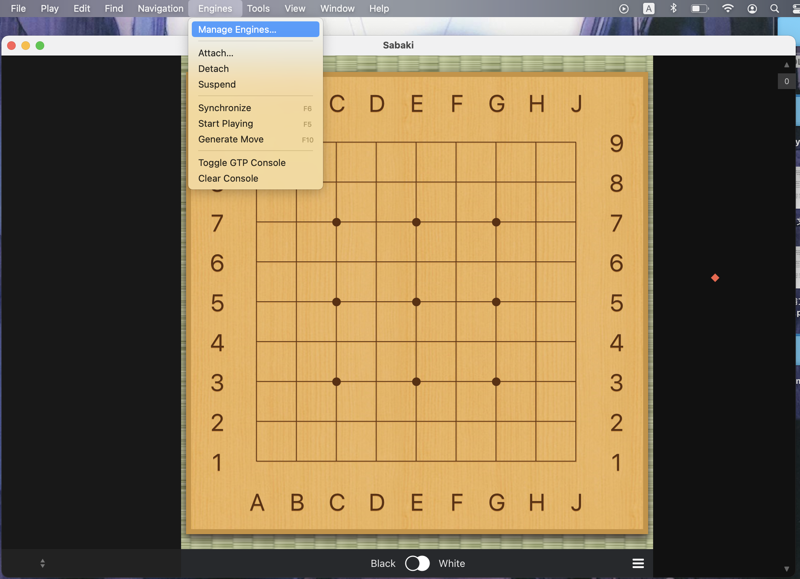
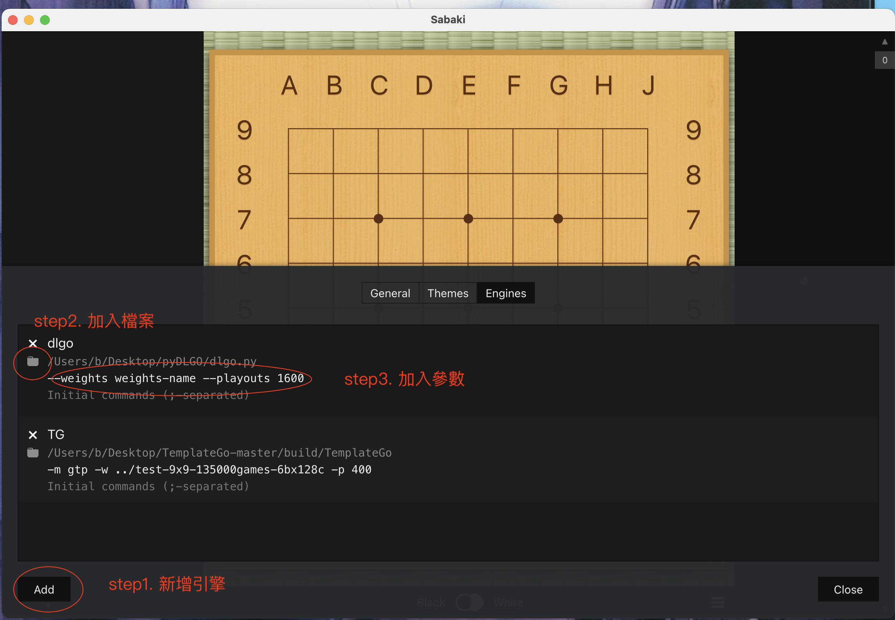
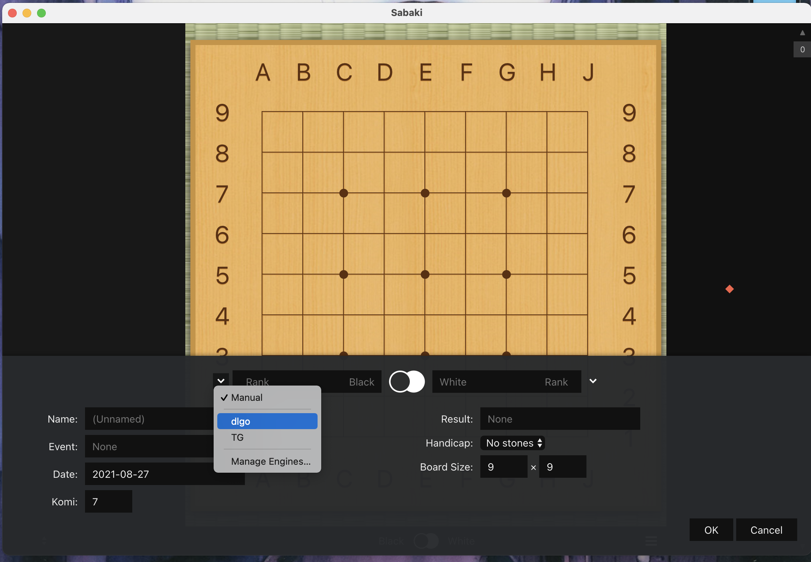

# 教學

## 零、依賴與來源

以下是部份程式碼和資源的來源
1. sgf.py 修改自 [jtauber/sgf](https://github.com/jtauber/sgf)
2. board.py 修改自 [ymgaq/Pyaq](https://github.com/ymgaq/Pyaq)
3. sgf.zip 來源自 [ymgaq/Pyaq](https://github.com/ymgaq/Pyaq)
4. gui.py 修改自 [YoujiaZhang/AlphaGo-Zero-Gobang](https://github.com/YoujiaZhang/AlphaGo-Zero-Gobang)

以下的 python 依賴庫需要安裝（請注意本程式使用 python3）
1. PyTorch（1.x 版本，如果要使用 GPU 請下載對應的 CUDA/cuDNN 版本）
2. NumPy
3. Tkinter
4. Matplotlib（僅訓練時需要）

以下程式需要 Java
1. KGS GTP

python 部份請輸入下列指令安裝，或自行使用下載可執行的版本

    pip3 install -r requirements.txt

## ㄧ、訓練網路

dlgo 包含 SGF 解析器，可以解析此格式的棋譜，並將棋譜作為訓練資料訓練一個網路，通過以下步驟可以訓練出一個基本網路。

#### 第一步、收集棋譜

需要收集訓練的棋譜，如果你沒有可使用的棋譜，可以使用附的 sgf.zip，裡面包含三萬五千盤左右的九路棋譜。也可以到 [Aya](http://www.yss-aya.com/ayaself/ayaself.html) 、[DarkGo](https://pjreddie.com/media/files/jgdb.tar.gz) 、[KGS](https://www.u-go.net/gamerecords/) 或是 [Leela Zero](https://leela.online-go.com/zero/) 上找到更多可訓練的棋譜。需要注意的是，dlgo 不能解析讓子棋棋譜，如有讓子棋棋譜需要事先清除，還有訓練棋譜至少要有數萬盤，不然的話價值頭（value head）容易崩潰，尤其是十九路。

#### 第二步、設定網路大小

網路的參數包含在 config.py 裡，所需要用到的參數如下

| 參數                 | 說明                                          |
| :------------------: | :------------------------------------------: |
| BLOCK_SIZE           | 殘差網路的 block 的數目，數目越大網路越大      |
| BLOCK_CHANNELS       | 卷積網路 channel 的數目，數目越大網路越大      |
| POLICY_CHANNELS      | 策略頭 channel 的數目，數目越大策略頭預準度越好 |
| VALUE_CHANNELS       | 價值頭 channel 的數目，數目越大價值頭預準度越好 |
| BOARD_SIZE           | 棋盤大小，必須和棋譜的大小一致                 |
| USE_SE               | 是否啟用 Squeeze-and-Excitation 網路結構      |
| USE_POLICY_ATTENTION | 是否啟用 self-attention 網路結構              |
| USE_GPU              | 是否使用 GPU 訓練。如果為 True ，會自動檢查是否有可用的 GPU ，如果沒有檢測到 GPU ，則會使用 CPU 訓練，如果為 False ，則強制使用 CPU 訓練。此參數建議使用 True |

<br>

#### 第三步、開始訓練

接下來便是開始訓練一個網路，所需要用到的參數如下
    
| 參數                 |參數類別            | 說明              |
| :---------------:    | :---------------: | :---------------: |
| -d, --dir            | string            | 要訓練的 SGF 檔案夾，不指定則直接使用 ```data-cache``` 的訓練資料|
| -s, --steps          | integer           | 要訓練的步數，越多訓練時間越久 |
| -b, --batch-size     | integer           | 訓練的 batch size，建議至少大於 128 ，太低會無法訓練 |
| -l, --learning-rate  | float             | 學習率大小 ，建議從 0.005 開始 |
| -w, --weights-name   | string            | 要輸出的網路權重名稱 |
| -r, --rate           | integer           | 下採樣率，有 1/N 的機率採樣訓練資料，剩餘的捨棄，可以大幅度增加訓練穩定度 |
| --lr-decay-steps     | integer           | 每 X steps 降低當前的學習率 |
| --lr-decay-factor    | float             | 降低學習率的乘數 |
| --load-weights       | string            | 載入其它權重，可以從此權重繼續開始訓練 |
| --noplot             | NA                | 訓練完後不要使用 Matplotlib 繪圖 |

<br>

以下是訓練範例命令

    $ python3 train.py --dir sgf-directory-name --steps 128000 --batch-size 512 --learning-rate 0.001 --weights-name weights

在一台有配備獨立顯示卡的電腦，大概數個小時內可以完成訓練，如果使用 CPU 訓練大概需要幾天時間。當網路權重出現後，就完成第一步的訓練了。如果你對當前的訓練結果不滿意，可到[這裏](../docs/Training.md)查看一些訓練時的小技巧。

## 二、啟動引擎

### Linux/MacOS

啟動引擎有四個參數是比較重要的

| 參數             |參數類別          | 說明                |
| :------------: | :---------------: | :---------------: |
| -w, --weights  | string            | 要使用的網路權重名稱，如果沒給則使用 random 的權重|
| -p, --playouts | integer           | MCTS 的 playouts，數目越多越強。預設值是 400 |
| -r, --resign-threshold | float     | 投降的門檻，0.1 代表勝率低於 10% 就會投降。預設值是 0.1 |
| -g, --gui      | NA                | 使用內建的圖形界面。|

<br>

注意在啟動以前，必須確定你有權限執行 dlgo.py ，如果沒有，請先使用 chmod 指令更改權限，以下是啟動的範例

    $ chmod 777 dlgo.py
    $ ./dlgo.py --weights weights-name --playouts 1600 -r 0.25

啟動之後，可以試試輸入 GTP 指令 ```showboard``` ，看看是否有正常運作，順利的話可以看到以下輸出

    showboard
       A  B  C  D  E  F  G  H  J 
     9 .  .  .  .  .  .  .  .  .  9
     8 .  .  .  .  .  .  .  .  .  8
     7 .  .  .  .  .  .  .  .  .  7
     6 .  .  .  .  .  .  .  .  .  6
     5 .  .  .  .  .  .  .  .  .  5
     4 .  .  .  .  .  .  .  .  .  4
     3 .  .  .  .  .  .  .  .  .  3
     2 .  .  .  .  .  .  .  .  .  2
     1 .  .  .  .  .  .  .  .  .  1
       A  B  C  D  E  F  G  H  J 

    = 
    

### Windows

Windows 系統是無法直接使用此程式的，必須先將 dlgo 打包成 exe 執行檔，可以使用 pyinstaller 打包此程式。首先通過 pip 安裝 pyinstaller，再執行如下指令


    C:\Users\administrator> pip3 install pyinstaller
    C:\Users\administrator> pyinstaller -D dlgo.py


另外，最好不要使用 pyinstaller -F 指令進行操作，否則很可能在運行程式後，C 盤下產生大量的臨時文件，導致 C 盤容量不足，並且每次啟動前需要解壓，使得啟動緩慢。當打包成功之後的操作與下面相同，引擎選中目標文件夾下 dist 文件夾中的 dlgo.exe 即可。

## 三、使用 GTP 介面

dlgo 支援基本的 GTP 介面，你可以使用任何支援 GTP 軟體，比如用 [Sabaki](https://sabaki.yichuanshen.de) 或是 [GoGui](https://github.com/Remi-Coulom/gogui) 將 dlgo 掛載上去，使用的參數參考第二部份。以下是如何在 Sabaki 上使用的教學。

#### 第一步、打開引擎選項


<div id="step_one">
    
</div>
<br>

#### 第二步、新增引擎

<div id="step_two">
    
</div>
<br>

#### 第三步、加載引擎

<div id="step_three">
    
</div>
<br>

設置完成後就可以和 dlgo 對戰了。如果想知道 dlgo 支援哪些 GTP 指令，可到[這裏](../docs/dlgoGTP.md)查看。

## 四、在 KGS 上使用

KGS 是一個網路圍棋伺服器，它曾經世界最大、最多人使用的網路圍棋。KGS 除了可以上網下棋以外，還能掛載 GTP 引擎上去，以下將會教學如何將 dlgo 掛載上去。

#### 第一步、下載 KGS 客戶端並註冊

請到 [KGS 官網](https://www.gokgs.com/index.jsp?locale=zh_CN)上下載對應系統的客戶端，如果是 Linux 系統，請選擇 Raw JAR File。接下來到 [KGS 註冊網站](https://www.gokgs.com/register/index.html)創立一個帳號。


#### 第二步、下載 KGS GTP 客戶端

到 [KGS GTP 網站](https://www.gokgs.com/download.jsp)下載專為 GTP 引擎設計的客戶端。

#### 第三步、掛載 GTP 引擎

首先我們需要創建並設定 config.txt 的參數，你可以參考以下直接設定

    name=帳號
    password=密碼
    room=Computer Go
    mode=custom

    rules=chinese
    rules.boardSize=9
    rules.time=10:00

    undo=f
    reconnect=t
    verbose=t

    engine=dlgo 的路徑和參數

設定完成後就可以輸入以下命令即可掛載引擎

    $ java -jar kgsGtp.jar config.txt
    
詳細的參數說明可以看 [KGS GTP 文件](http://www.weddslist.com/kgs/how/kgsGtp.html)。注意這是舊版的文件，如果要新版的文件，可以點擊在同個資料夾的 kgsGtp.xhtml，或是輸入以下命令在終端機觀看。

    $ java -jar kgsGtp.jar -h

#### 第四步、和 dlgo 在 KGS 上下棋

登錄 KGS 客戶端（注意，你第一個申請的帳號正在被引擎使用，請申請第二個帳號或使用參觀模式），可以從 “新開對局” 中找到你的帳號，點擊你的帳號即可發出對局申請。

## 五、參加 TCGA 競賽

TCGA 全名為台灣電腦對局協會，基本上每年會舉辦兩場各類型的電腦對局比賽，當然也包括圍棋。TCGA 的圍棋比賽是使用 KGS 伺服器連線的，如果你已經能順利掛載引擎到 KGS 上，恭喜你完成第一步比賽的準備，接下來可以設法強化 dlgo，像是訓練更大的權重，或是更改網路結構等等，希望你能在比賽中獲得好成績。

### 一些基本問題

如果你已經有自己的圍棋程式，並且想參加比賽，你可能會有一些問題

1. 如何繳費？費用多少？

    現場繳費，一般而言，費用是每個程式一千到兩千之間，學生可能會有優惠，實際費用需要看大會規定。如果要報名多個程式，假設每個程式一千元，則兩個倆千元，以此類推。


2. 參加比賽是否有任何限制？

    沒有限制，所有人皆可參加，但要求實做程式盡可能原創，不可直接拿他人寫好的程式參加比賽。


3. 參加圍棋比賽是否一定需要實做 GTP 界面？

    可以不實做 GTP 界面，但申請 KGS 帳號是必須的，你可以用手動的方式，將程式的輸出擺到盤面上，但這樣損失很多思考時間，建議還是實做 GTP 指令。


4. 建議最低需要實做的 GTP 指令？

     建議至少實做 ```quit```、```name```、```version```、```protocol_version```、```list_commands```、```play```、```genmove```、```clear_board```、```boardsize```、```komi``` 等指令。如果可行的話，建議也實做 ```time_settings```、```time_left``` 這兩個指令，因為每場比賽都有時間限，這兩個指令可以告訴程式剩餘時間，讓程式可以分配剩餘時間，但如果你可以確保程式能在規定時間內執行完畢（包括網路延遲），則可不必實做。


5. 參加圍棋比賽是否一定要到現場？

    不一定，但需要事先聯繫其他人，討論決定當天比賽如何進行。


6. 使用 dlgo 參加比賽是否可以？

    可以，但是要求報名時標注使用此程式，並且要有一定的改進，最後希望能將改進的程式能開源。

7. 比賽規則為何？

    通過 KGS 平台比賽。均採用中國規則且禁全同，九路思考時間為 10 分鐘不讀秒，十九路思考時間為 30 分鐘不讀秒。


### TCGA/ICGA 相關比賽列表

請查看[這裡](https://hackmd.io/@yrHb-fKBRoyrKDEKdPSDWg/ryoCXyXjK)

